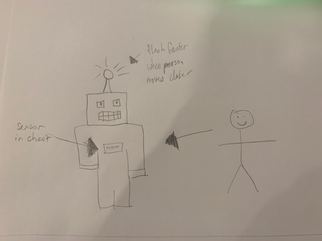
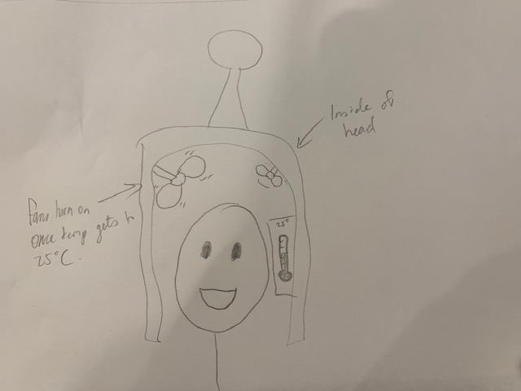
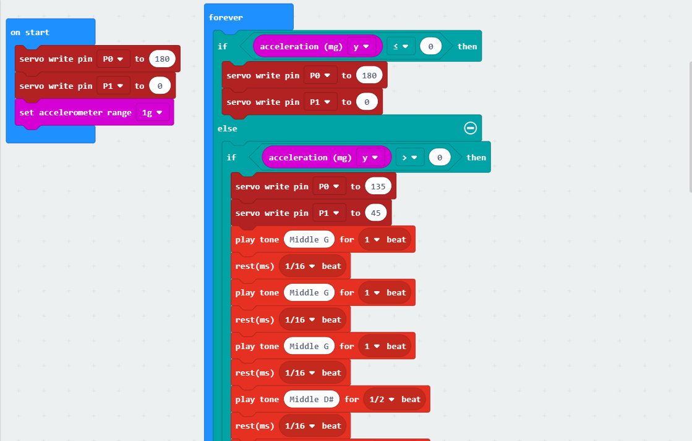
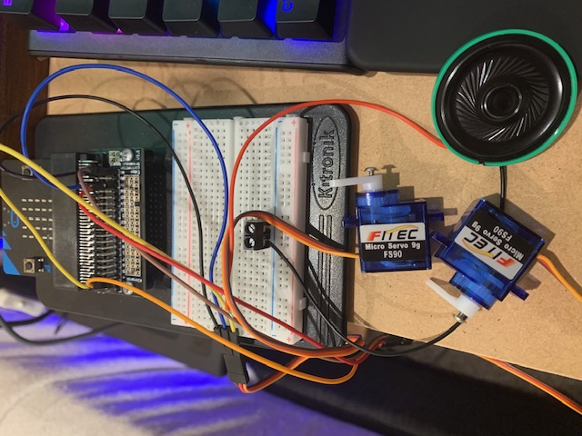

# 1701QCA Making Interaction - Assessment 2 workbook

## Project working title ##
Interactive robot head

## Related projects ##

### Related project 1 ###
*Creepy Doll face t-shirt*

https://www.morphsuits.com/creepy-doll-face-t-shirt-us

This project is related to mine because it can also interact with the user and others in some way. Despite the simplicity of being just an application on a smartphone inserted into a shirt, it gives a great illusion of the shirt being more than just static. 

### Related project 2 ###
*Animatronic Wings*

https://www.boredpanda.com/maleficent-cosplay-animatronic-wings-drisana-litke-drizzy-designs/?utm_source=google&utm_medium=organic&utm_campaign=organic

This project is related to mine because like mine, her wings are interactive. They may not be interactive with others in the sense that others can control it, but she can control it to seem interactive with the surroundings. 

### Related project 3 ###
*Bear costume*

https://www.youtube.com/watch?v=0cQ91lO4pH0

This project is related to mine because it shows a more intricate way of how to make a costume. Despite Adam Savage recreating a more realistic costume than me, I still got a good insight and some tips on making a costume. 

### Related project 4 ###
*Microbit:a simple board for props and cosplay*

https://www.youtube.com/watch?v=bV71tsuOo8A

This project is related to mine because it shows you how a microbit can be used to enhance a costume by adding lights. Although my costume will not have lights, it's stil interesting seeing the many uses of the microbit. 

### Related project 5 ###
*EVA foam breastplate*

https://www.kamuicosplay.com/2016/12/06/foamcos-2/

This project is related to mine because it uses a material for creating the parts of the costume called EVA foam. This is the same matieral that I have been experimenting with and using for my robot head. 

## Other research ##

### *Heating EVA Foam* ###
https://www.youtube.com/watch?v=6DVUlJ8JJzY
This link showed me how I can work with and shape the EVA foam to form a dome that is on the top of my robot's head. 

## Conceptual progress ##

### Design intent ###
I would like to make a costume that can interact with its surroundings instead of just being static like a lot of the costumes that are currently available. 

### Design concept 1 ###
A costume with a light attached to it. When someone comes too close to you, the light turns on and starts flashing, and a beeping sound will slowly start to be projected. The closer someone gets, the faster the beeping becomes. 

### Design concept 2 ###
A costume that cools you down. It gets hot in costumes, and when the temperature in costumes reaches certain degrees, a fan would automatically turn on.

### Final design concept ###
A costume that has facial expressions. You would be able to control it so that it can portray different emotions such as happy or sad. I like the idea of recreating Bender from Futurama with EVA foam for the head and styrofoam for the eyes. It would need to look sleek and not have any wires showing, so there would need to be a compartment in the head. 

### Interaction flowchart ###

## Physical experimentation documentation ##

This is my original, paper prototype that I had made of my robot head. This was modelled after Bender the Robot from the TV show Futurama. 

I then got the EVA foam and cut out the rough shape of the head, the eyes and the mouth. 

The EVA foam is stuck together with contact cement.

This piece is for the eye socket. 

Again, it is sealed with contact cement.

I attached the eye socket to the head.  

So that the eye sockets look more realistic, I put a backing through it and also started sealing the gaps in the head. 

I practiced spray painting with a spare sheet of foam. 

I added a lot more sealant to the foam to stop it from absorbing. It turned out better but not great. 

I started to spray a lot of sealant layers on the whole head. 

I started to paint my head in white paint once the sealant dried. 

I painted some styrofoam half-spheres in a light yellow.

I then painted black pupils on and the eyes were finished. 

This is my original code that I will be working with for my head. 

This is my initial wires setup for the microbit. Both servos work well, however I still need to fix the wiring so that the sound can play through the speaker. 

## Design process discussion ##
I have started to develop an interest in costumes that serve a greater purpose than just someone wearing the costume. I've noticed a greater demand in people wanting interactive/moving costumes to greater recreate the person/character that they are costuming. People either don't know how to make the costume more interactive, or they pay someone else a lot of money to create it for them. While doing some research, I had noticed a lot of people that make costumes use a material called EVA foam as it was lightweight but still created something that could look realistic. 

## Next steps ##
I still need to finish off making the robot head look more presentable by addings the eyes and the microbit. I intend to cut holes between the eyes and hide the microbit within the head so that there is an extension that moves the eyelids without seeing all the wires. The microbit still needs alteration as well. I believe the code is sufficient, but the wiring has to change in order for both servos to work with the potential of the speaker as well. I also need to figure out a way to keep the head steady for the user without them having to hold onto the head so that it doesn't move involuntarily. Additionally, I need to have a way to see out of the mouth without people being able to see inside the head. 
