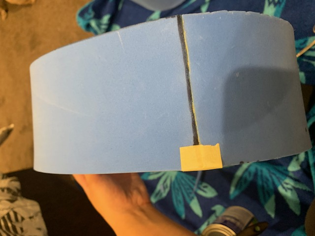

# 1701QCA Making Interaction - Assessment 2 workbook

When you have completed the template, submit the link to the GitHub Pages site for this repository as a link in Learning@Griffith. The link should be something like [https://qcainteractivemedia.github.io/1701QCA-Assessment2/]

## Project working title ##
Interactive robot head

## Related projects ##

### Related project 1 ###
*Creepy Doll face t-shirt*

https://www.morphsuits.com/creepy-doll-face-t-shirt-us

This project is related to mine because it can also interact with the user and others in some way. Despite the simplicity of being just an application on a smartphone inserted into a shirt, it gives a great illusion of the shirt being more than just static. 

### Related project 2 ###
*Animatronic Wings*

https://www.boredpanda.com/maleficent-cosplay-animatronic-wings-drisana-litke-drizzy-designs/?utm_source=google&utm_medium=organic&utm_campaign=organic

This project is related to mine because like mine, her wings are interactive. They may not be interactive with others in the sense that others can control it, but she can control it to seem interactive with the surroundings. 

### Related project 3 ###
*Bear costume*

https://www.youtube.com/watch?v=0cQ91lO4pH0

This project is related to mine because it shows a more intricate way of how to make a costume. Despite Adam Savage recreating a more realistic costume than me, I still got a good insight and some tips on making a costume. 

### Related project 4 ###
*Microbit:a simple board for props and cosplay*

https://www.youtube.com/watch?v=bV71tsuOo8A

This project is related to mine because it shows you how a microbit can be used to enhance a costume by adding lights. Although my costume will not have lights, it's stil interesting seeing the many uses of the microbit. 

### Related project 5 ###
*EVA foam breastplate*

https://www.kamuicosplay.com/2016/12/06/foamcos-2/

This project is related to mine because it uses a material for creating the parts of the costume called EVA foam. This is the same matieral that I have been experimenting with and using for my robot head. 

## Other research ##
*Include here any other relevant research you have done. This might include identifying tutorials, videos,  or other resources that have been helpful.*

### *Brief resource name/description* ###

*Provide a link for somebody else to find the resource. Then provide a few comments about what you have drawn from the resource.*

## Conceptual progress ##

### Design intent ###
I would like to make a costume that can interact with its surroundings instead of just being static like a lot of the costumes that are currently available. 

### Design concept 1 ###
*Outline three design concepts, each developed to a point where you anticipate it would be feasible to complete by the end of the course. Each should have a summary of the idea, a rough sketch of what it might be like, and any other notes you created while exploring the idea.* 

A costume with a light attached to it. When someone comes too close to you, the light turns on and starts flashing, and a beeping sound will slowly start to be projected. The closer someone gets, the faster the beeping becomes. 

### Design concept 2 ###
A costume that cools you down. It gets hot in costumes, and when the temperature in costumes reaches certain degrees, a fan would automatically turn on.

### Final design concept ###
A costume that has facial expressions. You would be able to control it so that it can portray different emotions such as happy or sad.

*This more fully developed concept should include consideration of the interaction scheme, technical functionality, fabrication approach, materials to be used, and aesthetic.*

### Interaction flowchart ###

## Physical experimentation documentation ##

*In this section, show your progress including whichever of the following are appropriate for your project at this point.
a.	Technical development. Could be code screenshots, pictures of electronics and hardware testing, video of tests. 
b.	Fabrication. 
Ensure you include comments about the choices you've made along the way.*

This is my original, paper prototype that I had made of my robot head. This was modelled after Bender the Robot from the TV show Futurama. 

## Design process discussion ##
*Discuss your process in getting to this point, particularly with reference to aspects of the Double Diamond design methodology or other relevant design process.*

I have started to develop an interest in costumes that serve a greater purpose than just someone wearing the costume. I've noticed a greater demand in people wanting interactive/moving costumes to greater recreate the person/character that they are costuming. People either don't know how to make the costume more interactive, or they pay someone else a lot of money to create it for them. 

## Next steps ##
I still need to finish off making the robot head look more presentable by addings the eyes and the microbit. I intend to cut holes between the eyes and hide the microbit within the head so that there is an extension that moves the eyelids without seeing all the wires. The microbit still needs alteration as well. I believe the code is sufficient, but the wiring has to change in order for both servos to work with the potential of the speaker as well. I also need to figure out a way to keep the head steady for the user without them having to hold onto the head so that it doesn't move involuntarily. 
